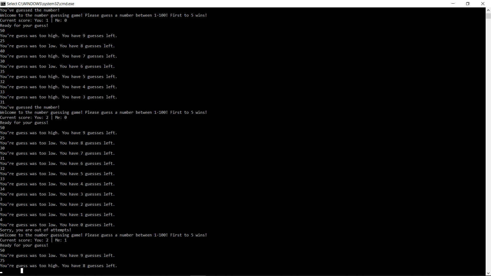

# Number Guessing Game

# Description
This is a simple number guessing game using the CLI. 
The computer will think of a number between 1 and 100. Your goal is to guess what number that is in 10 attempts. 
As you guess each number, the computer will let you know if you are higher or lower than it's number.

If you guess correctly, you get a point. If the computer stumps you, then the computer gets a point.
First one to 5 points wins!
